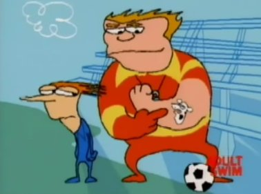

# emo-mcg



### motivation

the [McGurk effect](https://en.wikipedia.org/wiki/McGurk_effect)
is a commonly-studied audio-visual illusion within the
cognitive science literature.  from Wikipedia,

> The illusion occurs when the auditory component of one sound is paired with the visual component of another sound, leading to the perception of a third sound.

this repository is about providing an experimental setup to
examine how emotion interacts with the McGurk effect:

the experimental setup is imagined as something like
[damasio, tranel, and damasio's](doc/damasios_tranel__1991.pdf)
setup for producing emotion via visual (or possibly audiovisual)
cues.
the feature of [persistance](doc/anderson__2014.pdf), namely,

> [emotional] behaviors ... often outlast the stimuli that elicit them.

might be either used or worked around (depending on perspective)
by running several blocks of McGurk effect cues after each
emotion-producing cue such that a "return to baseline" may be
established...

### status

everything in this repository is as sandboxy as the preceding
section.

all that exists at time of writing is the beginnings of a
data-collection setup.  it (the experimental setup in `exp/`) is
written as a webapp in Clojure.

the Clojure project still retains much of the form of the
[Chestnut](https://github.com/plexus/chestnut) 0.14.0 (66af6f40)
template used to generate it.

Most extensions have been added to `dev/user.clj` such that
the `lein repl` command is the main point of entry for development.
In particular, the following functions are available:

```clojure
(rtest) ;; reload and run tests
(rdb) ;; database reset
(run) ;; run data collection setup w/ figwheel ... see localhost:3449
(stop) ;; stop figwheel
(run-devcards) ;; run devcards "test", on 3449 again
(brep) ;; browser repl --- available whenever figwheel is spinning
```

### thanks

many heartfelt and sincere thanks to everyone at
[Shamslab](https://shamslab.psych.ucla.edu/people/) lab
for telling me that there's such a thing as cognitive science
and humoring me over the course of many discussions regarding
multisensory perception.
